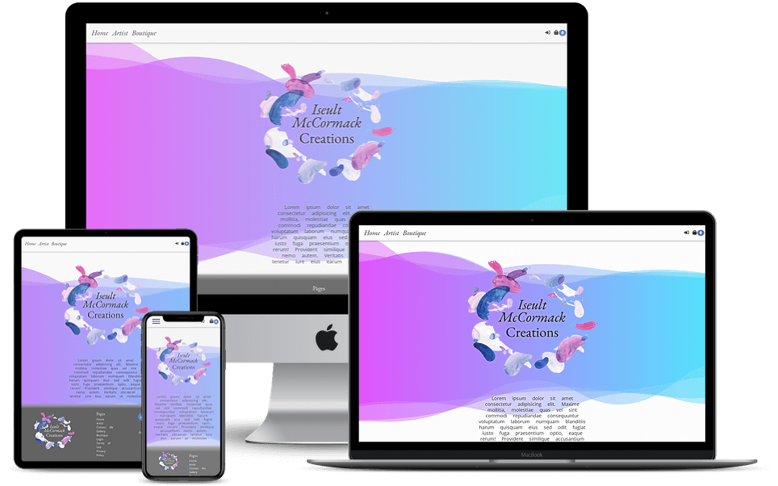

# Iseult McCormack Creations

Iseult McCormack Creations is an online store where she can sell her art.

Website Links : [Iseult McCormack Creations](https://www.iseultmccormackcreations.eu/)

---

## Authors

The Website was produced by **Digital-Web Solutions**.

### Develper(s)

- [Clinton Davis]([clintondavis](https://www.clintondavis.org/))
  
### Content by

- Iseult McCormack - Iseult McCormack Creations

---

## Technologies

### Core Languages, Frameworks, Editors

- [HTML 5](https://en.wikipedia.org/wiki/HTML) ~ Markup language designed to be displayed in a web browser.
- [CSS 3](https://en.wikipedia.org/wiki/Cascading_Style_Sheets) ~ Style sheet language used for describing the presentation of a document in HTML.
- [Python 3.9.2](https://code.jquery.com/) ~ High-level, general-purpose programming language.
- [Django 3.2.1](https://www.djangoproject.com/) ~ Django is a high-level Python Web framework.
- [jQuery 3.5](https://code.jquery.com/) ~ lightweight JavaScript library.
- [Bootstrap 4.6](https://getbootstrap.com/) ~ Design and customize responsive mobile-first sites.
- [Heroku](https://heroku.com) ~ A cloud based platform - as a service enabling deployment of CRUD applications
- [Heroku Postgres](https://www.heroku.com/postgres) ~ PostgreSQL's capabilities - as a fast, functional, and powerful data resource.

#### Third-Party Tools

- [GitHub](https://github.com/) ~ Distributed version control and source code management (SCM) functionality of Git, plus its own features.
- [Font Awesome](https://fontawesome.com/) ~ Font Awesome icons
- [Cloudinary](https://cloudinary.com/) ~ Cloud-based image and video management platform
- [Git](https://git-scm.com/) ~ Distributed version control system
- [autopep8](https://pypi.org/project/autopep8/) ~ A tool that automatically formats Python code to conform to the PEP 8 style guide
- [Codacy](https://app.codacy.com/) ~ Automated Code Review
- [Google Fonts](https://fonts.google.com/) ~ A library free licensed font families, an interactive web directory for browsing the library.

## Features

- **User Reg & login**: Using 3rd party [Django-Alluth](https://django-allauth.readthedocs.io/en/latest/#) Is used to manage the registration and login process. In order to ensure the security of costume details, every precaution must be taken.

- **Shipping Charges**: The products vary in size, the postage will have to be adjusted accordingly, considering the products and location. If the Order exceeds the Free Shipping threshold, shipping is free.

- **Stock Control**: The product is unique, so the stock control must be accurate. Upon the payment of an order and the completion of an payment process, the quantity is deducted from the inventory and the item is set to 'Out of stock'.
  
- **Administration area**: Serves as its control centre. (Access only granted authorised.)
 Here, you may:
  - Grand access to users to become **Staff** or **Administraters**
  - Add, delete, or edit item details.
  - See users, user details, user order history.
  - See orders, order payments, and order history.
  - Check stock levels and make items in or out of stock.
  - Edit **About bio**, **Product** general information, to evolve with the products.

- **STRIPE payment system**: Full integration with STRIPE. Utilising their API and Webhook functionality. As well as utilizing the internal security features.
  
- **Confirmation email**: Following the completion of a STRIPE payment. The customer receives a confirmation email and a second email with the details of the order is sent to the store administrator.
- **User Dashboard**: When a user registers and logs in, he/she is automatically setup with a dashboard. Here you will be able to:
  - Access previous orders, with the STRIPE receipt associated with that order.
  - Change shipping information.

---

## Environment Variables

To run this project, you will need to add the following environment variables to your .env file

| Key                 |      Value      |
| ------------------- | :-------------: |
| SECRET_KEY          | < Your Values > |
| EMAIL_HOST_PASS     | < Your Values > |
| EMAIL_HOST_USER     | < Your Values > |
| NOTIFY_EMAIL        | < Your Values > |
| DEFAULT_FROM_EMAIL  | < Your Values > |
| STRIPE_PUBLIC_KEY   | < Your Values > |
| STRIPE_SECRET_KEY   | < Your Values > |
| STRIPE_SECSTRIPE_WH | < Your Values > |
| CLOUD_NAME          | < Your Values > |
| API_KEY             | < Your Values > |
| API_SECRET          | < Your Values > |

---

## Acknowledgements

[Pure CSS Loaders](https://loading.io/css)

## Deployment

This Project is deployed on [Heroku](https://dashboard.heroku.com/) using [Heroku PostgreSQL](https://dashboard.heroku.com/) database, and [Cloudinary](https://cloudinary.com/) to host the images, and [Whitenoise](http://whitenoise.evans.io/en/stable/index.html) to serve the static files.
